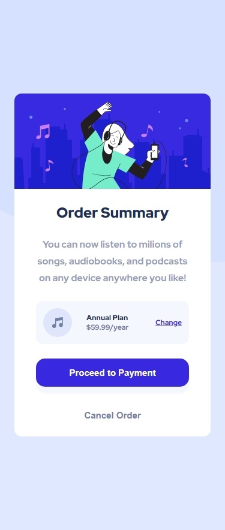

# Frontend Mentor - Order summary card solution

This is a solution to the [Order summary card challenge on Frontend Mentor](https://www.frontendmentor.io/challenges/order-summary-component-QlPmajDUj). Frontend Mentor challenges help you improve your coding skills by building realistic projects. 

## Table of contents

- [Overview](#overview)
  - [The challenge](#the-challenge)
  - [Screenshot](#screenshot)
  - [Links](#links)
- [My process](#my-process)
  - [Built with](#built-with)
  - [What I learned](#what-i-learned)
  - [Continued development](#continued-development)
  - [Useful resources](#useful-resources)
- [Author](#author)
- [Acknowledgments](#acknowledgments)

## Overview

### The challenge

Users should be able to:

- See hover states for interactive elements

### Screenshot



### Links

- Live Site URL: [See the demo on Github Pages](https://jimi-s-frontend-mentor-cs.github.io/Order-summary-component/)

## My process

### Built with

- Semantic HTML5 markup
- CSS custom properties
- Flexbox
- CSS Grid
- Mobile-first workflow
- SASS

### What I learned

I learned more about the ```place-items``` and ```place-content``` properties.

### Continued development

For this challenge I barely need help, meaning that over time I'm learning and understanding more of what I do and how I can do it.

I still need to learn more about flexbox in general and the mobile-first workflow

### Useful resources

- [Kevin Powell](https://www.youtube.com/kepowob) - This amazing guy helped me A TON getting me back into Web Development, refreshing by knowledge and also teaching me new stuffs and tricks (especially with CSS and flexbox).

## Author

- Frontend Mentor - [@JimiIT92](https://www.frontendmentor.io/profile/JimiIT92)

## Acknowledgments

Big shoutout to [Kevin Powell](https://www.youtube.com/kepowob) for sharing his resources to the public, so other developers like me can learn new stuff!